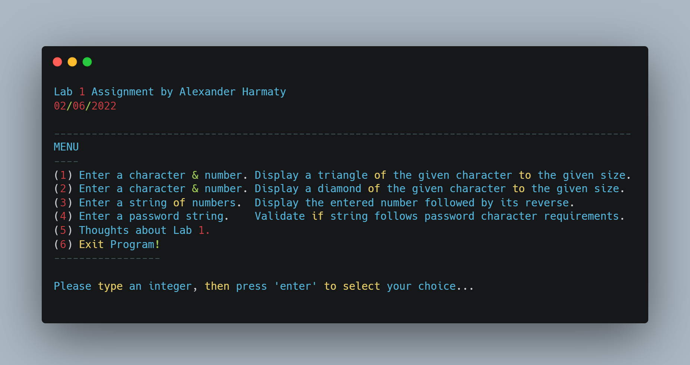

# Generate Patterns, Reverse Strings, Validate Passwords

(FSC-BCS-426-Lab1)

## Output Menu

## Assignment Context

This project was one of the first assignments for my C# programming class.

The goal of this assignment was for students to get an introduction to C# and ASP.NET, so we were prompted to add four specific features exploring strings and patterns. 

We were expected to be able to generate two different patterns based on user input, reverse a string provided by the user, and validate a given password to assure it meets the requirements.

This was a solo assignment made with C# and ASP.NET using Visual Studio 2022.

## Features

The program includes five options: 
* (1) to display a triangle of a given character and size, 
* (2) to display a diamond of a given character and size, 
* (3) to display a mirrored number, 
* (4) to validate a password, and 
* (5) to provide comments about the lab. 

## How It Works

My program allows the user to select from a menu of options to perform the various tasks. 

It begins by printing out the name of the assignment and the current date.

Then, the program enters a loop that displays a menu of options and prompts the user to select an option by entering an integer. 

The program then uses a switch statement to perform the selected task.

The program ends when the user selects the option to exit.

### Option 1

.png)

The program prompts the user to enter a character and an integer, and then displays a triangle made of the given character to the given size.

### Option 2

.png)

The program prompts the user to enter a character and an integer, and then displays a diamond made of the given character to the given size.

### Option 3

.png) 

The program prompts the user to enter an integer, and then displays the entered number followed by its reverse.

### Option 4

.png)

The program prompts the user to enter a password, and then validates the password based on several criteria.

### Option 5

The program displays comments about the lab and how appropriate it was as a first lab for learning C#.
